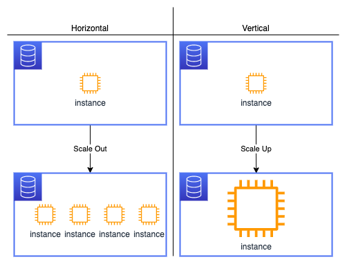
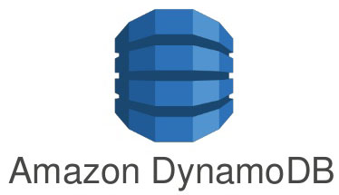
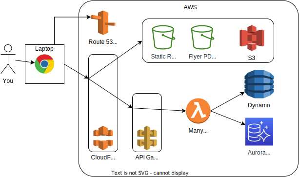
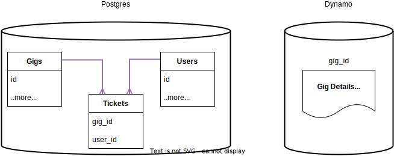
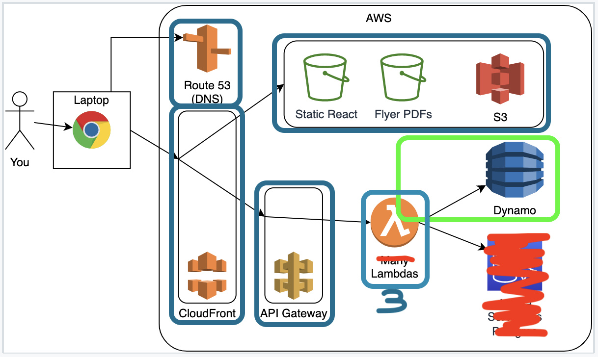
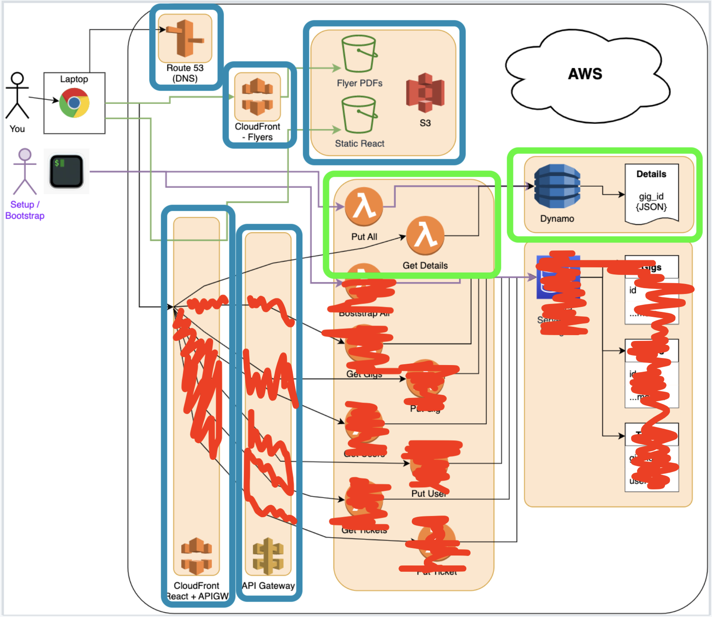
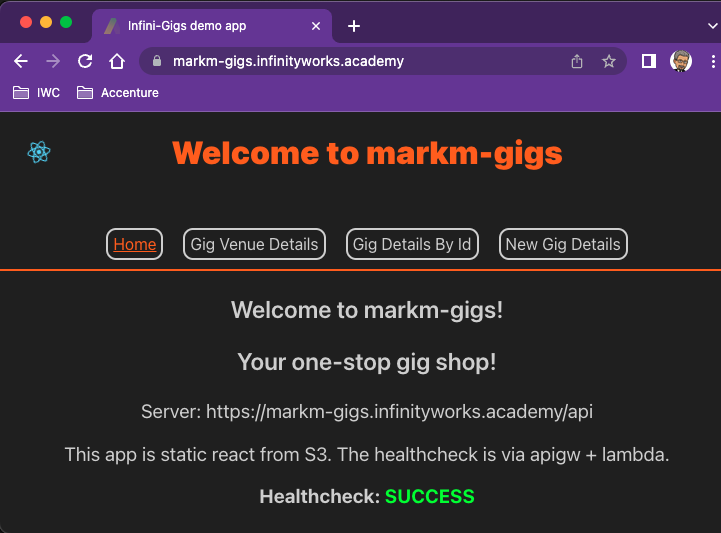

# AWS DynamoDB with CDK

Hosting a non-relational database

<aside class="notes">
    N/A
</aside>

---

## Overview

- What is NoSQL
- Pros and cons of non-relational data stores
- DynamoDB with CDK
- Getting data in and out with JS

<aside class="notes">
    N/A
</aside>

---

## Objectives

- Learn about NoSQL databases and why we need them
- Get introduced to DynamoDB and learn why we would use it
- Learn about some of DynamoDB's key features
- Batch put data in
- Scan a list of items out
- Get individual items out by ID
- Put individual data in

<aside class="notes">
    N/A
</aside>

---

### AWS sessions list

- AWS + Cloud intro 01 ✅ _1.5hrs_
- AWS + Cloud intro 02 ✅ _1.5hrs_
- AWS 01 S3 - storage (manual) ✅ _1.5hrs_
- AWS 02 CDK intro - with S3 ✅ _3.0hrs_
- AWS 03 Cloudfront - get files out of s3 ✅ _1.5hrs_
- AWS 04 Lambda - running code ✅ _3.0hrs_
- AWS 05 Api Gateway - put an API in front of Lambda ✅ _3.0hrs_
- AWS 06 Aurora Serverless Postgres - relational db ✅ _3.0hrs_
- AWS 07 DynamoDB - non-relational db ⬅ _3.0hrs_

<aside class="notes">
    N/A
</aside>

---

### Question

> What do you remember from the session on Relational DBs?

- What is a database?
- What is SQL?
- What are DML and DDL?
- What are some SQL commands and what do they do?

<aside class="notes">
    N/A
</aside>

---

### NoSQL Databases

<span>Document stores (stores JSON, XML etc.)</span><!-- .element: class="fragment" -->

<span>Key-Value DBs</span><!-- .element: class="fragment"-->

<span>ColumnarDBs</span><!-- .element: class="fragment" -->

<span>GraphDBs</span><!-- .element: class="fragment" -->

<aside class="notes">
    "Documents" here are files with a structure but not conforming to a schema (JSON, XML) rather than PowerPoints or something. MongoDB, CouchDB, DocumentDB are all document DBs.

    Key-Value DB is totally non-relational. Example of Key-Value DB are DynamoDB, Redis. S3 is too, but not often used that way.

    ColumnarDBs may be relational. Example: Amazon Redshift

    GraphDBs are highly relational but the relations are at the object level rather than at the schema/table level. Example: Neo4j
</aside>

---

### So why would we use them?

These 4 different types of NoSQL database have very different advantages and use cases, but some things they provide over SQL databases might be:

<span>Dynamic schema - no set structure</span><!-- .element: class="fragment" -->

<span>Microservice friendly - smaller distributed services can make a monolith DB overkill</span><!-- .element: class="fragment" -->

<span>Sharding - automatically spread their data across the number of "nodes"/servers you've got</span><!-- .element: class="fragment" -->

<span>Easily scalable - more servers means more replication and load balancing</span><!-- .element: class="fragment" -->

<span>Auto replication - allows for high availability</span><!-- .element: class="fragment" -->

<aside class="notes">
    Highlight that SQL & other monolithic DBs can still be useful and practical for micro-services.

    The dynamic schema of some databases seems to make them more flexible but actually makes them less flexible as you cannot make arbitrary queries with JOINs.

    The most shardable and scalable databases are the least relational (the relations are what prevent sharding). Typically these are key-value stores.
</aside>

---

### Scaling

There are 2 ways to scale any service, horizontal (scale-out) and vertical (scale-up).

The design of NoSQL databases typically lends itself to horizontal scaling.

<!-- .element: class="centered" -->

<aside class="notes">
    Discuss potential pitfalls of either. Cost? Availability? Consistency? Management Overhead (if running VMs)? Loss of ability to join across shards?
</aside>

---

### They're not the silver bullet

<span>Sacrifice strong guarantees</span><!-- .element: class="fragment" -->

<span>Transactions aren't always supported</span><!-- .element: class="fragment" -->

<span>Lose the ability to do complex JOINS on data (much less flexible querying)</span><!-- .element: class="fragment" -->

<span>Data is duplicated across many entries - danger of inconsistency</span><!-- .element: class="fragment" -->

<span>Data is often itself relational, even if it is being stored in a non-relational database</span><!-- .element: class="fragment" -->

<aside class="notes">
    strong guarantees includes things like not-null columns, consistent data types, foreign key constraints.
</aside>

---

### Emoji Check:

How do you feel about the pros and cons so far?

1. 😢 Haven't a clue, please help!<br/>
2. 🙁 I'm starting to get it but need to go over some of it please<br/>
3. 😐 Ok. With a bit of help and practice, yes<br/>
4. 🙂 Yes, with team collaboration could try it<br/>
5. 😀 Yes, enough to start working on it collaboratively<br/>

<aside class="notes">
    The phrasing is such that all answers invite collaborative effort, none require solo knowledge.

    The 1-5 are looking at (a) understanding of content and (b) readiness to practice the thing being covered, so:

    1. 😢 Haven't a clue what's being discussed, so I certainly can't start practising it (play MC Hammer song)
    2. 🙁 I'm starting to get it but need more clarity before I'm ready to begin practising it with others
    3. 😐 I understand enough to begin practising it with others in a really basic way
    4. 🙂 I understand a majority of what's being discussed, and I feel ready to practice this with others and begin to deepen the practice
    5. 😀 I understand all (or at the majority) of what's being discussed, and I feel ready to practice this in depth with others and explore more advanced areas of the content
</aside>

---

### NoSQL DBs

- MongoDB - document-oriented database
- HBase - distributed storage for sparse data
- DynamoDB - key-value and document store
- Redis - in-memory key-value store

<aside class="notes">
    N/A
</aside>

---

### DynamoDB

A highly scalable key-value/document store provided by AWS.

And also what we will be using for the rest of this session!



<aside class="notes">
    It's sort of a document store because the value can have a structure and the APIs take JSON input. Its main characteristics are that of a key-value store. Key-document store?
</aside>

---

### Why would we want to use it?

<span>Management is easy - it's serverless!</span><!-- .element: class="fragment" -->

<span>It is really fast!</span><!-- .element: class="fragment" -->

<span>Simple API</span><!-- .element: class="fragment" -->

<span>Scales - it's serverless!</span><!-- .element: class="fragment" -->

<span>Highly resilient</span><!-- .element: class="fragment" -->

<span>Great integrations with other AWS services</span><!-- .element: class="fragment" -->

<span>Flexible pricing</span><!-- .element: class="fragment" -->

<aside class="notes" data-markdown>
    - database as a service
    - Management: no servers or infrastructure to manage - reduces complexity and admin overhead
    - scales: configured to auto-scale
    - highly resilient (replicated across multiple storage nodes by default across AZs, no single point of failure)
</aside>

---

### It's not without downsides

<span>You need to design around your access patterns</span><!-- .element: class="fragment" -->

<span>Reads are eventually consistent by default</span><!-- .element: class="fragment" -->

<span>Simple API (few features)</span><!-- .element: class="fragment" -->

<span>It's AWS specific</span><!-- .element: class="fragment" -->

<span>It's opaque - it's serverless!</span><!-- .element: class="fragment" -->

<aside class="notes">
    You can start with a great data set up with a sensible partition key and sort key, only to have the access patterns change and it is a nightmare to make the data work to that.

    eventually consistent by default: you can specify if you want strongly consistent reads on a query basis
        - slower
        - uses more throughput capacity
</aside>

---

### DynamoDB features

<span>Authentication using IAM</span><!-- .element: class="fragment" -->

<span>Streams for integrating with Lambda</span><!-- .element: class="fragment" -->

<span>Auto-scaling</span><!-- .element: class="fragment" -->

<span>On-demand and provisioned capacity pricing</span><!-- .element: class="fragment" -->

<span>Point-in-time recovery and backups</span><!-- .element: class="fragment" -->

<span>Cross-region tables</span><!-- .element: class="fragment" -->

<aside class="notes">
    Streams - a time ordered sequence of events to items in the DynamoDB database - effectively an accessible log of events that have occurred over the last 24 hours that can be
    consumed - https://docs.aws.amazon.com/amazondynamodb/latest/developerguide/Streams.html
</aside>

---

### DynamoDB cost

When using DynamoDB you get charged per read or write operation.

How much you are charged depends on on how many _Read Capacity Units_ (RCUs) or _Write Capacity Units_ (WCUs) you consume during your read or write request.

<aside class="notes">
    depends on how many items you read/write and how big they are
</aside>

---

### DynamoDB throughput capacity

You can choose between _on-demand_ and _provisioned_ capacity modes.

_Provisioned capacity_: you specify the number of data reads and writes per second that you require for your application...

- Useful if you can predict your application traffic
- Cheaper
- **But** if requests exceed the provisioned throughput capacity they will be throttled

_On-demand_: DynamoDB scales to match demand...

- Useful if you have unpredictable application traffic
- More expensive

<aside class="notes">
    throughput: capacity & speed
</aside>

---

### Emoji Check:

How do you feel about the main concepts of DynamoDB?

1. 😢 Haven't a clue, please help!<br/>
2. 🙁 I'm starting to get it but need to go over some of it please<br/>
3. 😐 Ok. With a bit of help and practice, yes<br/>
4. 🙂 Yes, with team collaboration could try it<br/>
5. 😀 Yes, enough to start working on it collaboratively<br/>

<aside class="notes">
    The phrasing is such that all answers invite collaborative effort, none require solo knowledge.

    The 1-5 are looking at (a) understanding of content and (b) readiness to practice the thing being covered, so:

    1. 😢 Haven't a clue what's being discussed, so I certainly can't start practising it (play MC Hammer song)
    2. 🙁 I'm starting to get it but need more clarity before I'm ready to begin practising it with others
    3. 😐 I understand enough to begin practising it with others in a really basic way
    4. 🙂 I understand a majority of what's being discussed, and I feel ready to practice this with others and begin to deepen the practice
    5. 😀 I understand all (or at the majority) of what's being discussed, and I feel ready to practice this in depth with others and explore more advanced areas of the content
</aside>

---

### Dynamo DB tables - core components

- _Table_: a collection of data
- _Items_: a group of attributes (similar, but not the same as a "row" in a relational database)
- _Attributes_: the parts of each _Item_ (similar, but not the same as a "column" in a relational database)

See [Core components of Amazon DynamoDB](https://docs.aws.amazon.com/amazondynamodb/latest/developerguide/HowItWorks.CoreComponents.html) for more details.

<aside class="notes">
    no restriction on attributes (none, all, some, different)
</aside>

---

### Dynamo DB tables - concepts

- Each item must have a unique identifier (a primary key)
- Tables are schemaless: there is no restriction on attributes, and they do not need to be defined beforehand
- Attributes can be deeply nested

<aside class="notes">
    N/A
</aside>

---

### Primary Key

Each item must have a unique primary key. The primary key can either be _simple_ or _composite_:

- _Simple Primary Key_: comprises of a **Partition Key** (sometimes called the hash key)
- _Composite Primary Key_: comprises of a **Partition Key** and a **Sort Key** (sometimes called the range key)

<aside class="notes">
    Further information at https://aws.amazon.com/blogs/database/choosing-the-right-dynamodb-partition-key/
</aside>

---

### DynamoDB Operations

What key operations can we run on a Dynamo table?

- _Scan_ - fetch all
- _Query_ - search by partition key and optionally the sort key
- _Put item_ - individual or in batch
- _Update item_ - individual
- _Delete item_ - individual or in batch

There's a comprehensive [list from AWS](https://docs.aws.amazon.com/amazondynamodb/latest/APIReference/API_Operations.html).

<aside class="notes">
    N/A
</aside>

---

### Scan vs Query

**Query** you have to specify the partition key, optionally also the sort key.

**Scan** is more flexible, but is least efficient because it has to read the entire table, checking every entry.

You can further filter on attributes (but this just discards data after retrieving it).

<aside class="notes">
    scan moves through ALL items item by item - aka the entire table, consumes all the capacity for all items, so expensive
</aside>

---

### Emoji Check:

How do you feel about scans, queries and partition keys?

1. 😢 Haven't a clue, please help!<br/>
2. 🙁 I'm starting to get it but need to go over some of it please<br/>
3. 😐 Ok. With a bit of help and practice, yes<br/>
4. 🙂 Yes, with team collaboration could try it<br/>
5. 😀 Yes, enough to start working on it collaboratively<br/>

<aside class="notes">
    The phrasing is such that all answers invite collaborative effort, none require solo knowledge.

    The 1-5 are looking at (a) understanding of content and (b) readiness to practice the thing being covered, so:

    1. 😢 Haven't a clue what's being discussed, so I certainly can't start practising it (play MC Hammer song)
    2. 🙁 I'm starting to get it but need more clarity before I'm ready to begin practising it with others
    3. 😐 I understand enough to begin practising it with others in a really basic way
    4. 🙂 I understand a majority of what's being discussed, and I feel ready to practice this with others and begin to deepen the practice
    5. 😀 I understand all (or at the majority) of what's being discussed, and I feel ready to practice this in depth with others and explore more advanced areas of the content
</aside>

---

### InfiniGigs revisited

In the InfiniGigs app we have a Dynamo (non-relational) database holding our asymmetric gigs data:



This allows us to have persistent data over time.

<aside class="notes">
    Discuss with the class before going to the next slide
</aside>

---

### InfiniGigs revisited

In more detail that is:


<aside class="notes">
    Discuss with the class before going to the next slide
</aside>

---

### Infini Gigs schema

In the full app the dynamo schema is one `Gigs-Data` table:



We'll only do the dynamo table this session.

<aside class="notes">
    Discuss with the class before going to the next slide
</aside>

---

### InfiniGigs revisited

In this session we are going to look only at Dynamo:



But... to do that we will need to practice running some queries on the DB so we can fetch and insert data. So the shells of the lambdas are our starting point.

<aside class="notes">
    The shells of the lambdas are our starting point - we will fill in the code they need to run.
</aside>

---

### InfiniGigs revisited



<aside class="notes">
    N/A
</aside>

---

### Emoji Check:

On a high level, understand that we are about to put the non-relational storage into our system?

1. 😢 Haven't a clue, please help!
2. 🙁 I'm starting to get it but need to go over some of it please
3. 😐 Ok. With a bit of help and practice, yes
4. 🙂 Yes, with team collaboration could try it
5. 😀 Yes, enough to start working on it collaboratively

<aside class="notes">
    The phrasing is such that all answers invite collaborative effort, none require solo knowledge.

    The 1-5 are looking at (a) understanding of content and (b) readiness to practice the thing being covered, so:

    1. 😢 Haven't a clue what's being discussed, so I certainly can't start practising it (play MC Hammer song)
    2. 🙁 I'm starting to get it but need more clarity before I'm ready to begin practising it with others
    3. 😐 I understand enough to begin practising it with others in a really basic way
    4. 🙂 I understand a majority of what's being discussed, and I feel ready to practice this with others and begin to deepen the practice
    5. 😀 I understand all (or at the majority) of what's being discussed, and I feel ready to practice this in depth with others and explore more advanced areas of the content
</aside>

---

### Code Along - InfiniGigs files!

Download and extract _this_ sessions `./exercises` zip.

> Make sure it's the `aws-iac-07-cdk-dynamo-db` zip file!

<aside class="notes">
    Check everyone has this!
</aside>

---

### Code along - folder check!

Open a terminal in the extracted `./exercises` folder for this session:

- Run `pwd`
    - you should see the right `aws-iac-07-cdk-dynamo-db/exercises` folder path
- Run `ls -la`
    - You should see the `gig-flyers`, `client` and `cdk` folders

Now open that same set of files in VS Code.

<aside class="notes">
    Check everyone has this!

    Get folks to shut all old VS Code windows and terminals.
</aside>

---

### Code Along - Check your env vars

Run the following in your terminal:

```bash
echo $GIGS_STACK_NAME
```

And make sure it gives you some output.

Speak now if it does not - we need this!

<aside class="notes">
    Check everyone has this
</aside>

---

### Code along - install packages

In the terminal in the `./exercises` folder for this session:

Run `./install.sh`
This will run npm i in the following locations:

- client
- cdk
- cdk/functions

<aside class="notes">
  N/A
</aside>

---

### Code along - Verify env vars

Run the following and check that all commands return you a value:

```sh
echo $GIGS_STACK_NAME
echo $GIGS_DOMAIN
echo $AWS_PROFILE
```

You should see something like this (the names may vary for each course):

```sh
markm-gigs
somedomain.academy
academy-aws-ngei
```

<aside class="notes">
    Make sure that all learners see an output for each variable
</aside>

---

### Code Along - Build react

Let's build our react application so it's up to date and has our `GIGS_STACK_NAME` in it:

```sh
cd client
chmod a+x build.sh
./build.sh
```

This version has lots of the UI in it, ready and waiting for us to wire in the API!

<aside class="notes">
    So "VITE_STACK_NAME" etc is used in the client code - we have skirted over this until this session

    The build script sorts out our environment variables for us and runs npm install and npm run build
</aside>

---

### Code Along - initial deploy

To get everyone's stacks to the same starting point let's deploy now from the `./exercises/cdk` folder:

```sh
cd cdk # if you're not there already
aws-logon # or use the full version
npx cdk deploy
```

<aside class="notes">
    Check everyone has done this
</aside>

---

### Lets check it!

Browse to your UI on the homepage... You should see a UI up with 4 tabs (a happy healthcheck, gig details, get gig details by id, new gigs details)?



<aside class="notes">
    Verify everyone has done this
</aside>

---

### Quick tour

Let’s have a quick look at what we have given you so we know what we are working with. In particular, there are:

- lambdas pre-defined in CDK
- a predefined bootstrap lambda (done with full code)
- the dynamo utility functions the lambdas call are empty / to-do
    - this file has the connection code using the env vars
- no CDK constructs yet for DynamoDB

> The instructor will show you the skeleton code

<aside class="notes">
    The aim here is to get them to do mainly dynamo related work, so all of its prepared in advance with them only needing to think about connecting to DynamoDB and using its syntax
</aside>

---

### Imports required

At the top of our `./exercises/cdk/lib/cdk-stack.ts` file we need the dynamo import:

```ts
import * as dynamodb from 'aws-cdk-lib/aws-dynamodb'
```

<aside class="notes">
    Copy the code from `./solutions/cdk/lib/cdk-stack.ts` rather than the slides
</aside>

---

### DynamoDB table name

This needs to be shared between Dynamo and the Lambdas that use it.

Find the `// dynamo table name` code block and update it with this:

```ts
// dynamo table name
const dynamoTableName = `${props.subDomain}-gig-data`
```

<aside class="notes">
    Copy the code from `./solutions/cdk/lib/cdk-stack.ts` rather than the slides
</aside>

---

### Dynamo construct

Now we can add the dynamo db table it's self. Find the `// dynamo table construct` comment and add in this:

```ts
// dynamo table construct
const dynamoTable = new dynamodb.Table(this, 'gig-data', {
  tableName: dynamoTableName,
  partitionKey: {
    name: 'gig_id',
    type: dynamodb.AttributeType.NUMBER
  },
  billingMode: dynamodb.BillingMode.PAY_PER_REQUEST,
  removalPolicy: cdk.RemovalPolicy.DESTROY,
})
```

<aside class="notes">
    Copy the code from `./solutions/cdk/lib/cdk-stack.ts` rather than the slides
</aside>

---

### Dynamo construct

What have we configured here?

- `tableName` - to be shared with the lambdas
- `partitionKey` - an object with two essential settings
    - `name` - the primary key column name, 'gig_id'
    - `type` - the key is numeric
- `billingMode` - the cheapest option for us. We'd want different choices at scale
- `removalPolicy` - remove this when we destroy the stack

<aside class="notes">
    Copy the code from `./solutions/cdk/lib/cdk-stack.ts` rather than the slides
</aside>

---

### Lambda env vars

Now we can pass the table information to the lambdas - it's name, and which region it is in.

Find the `lambdaEnvVars` and the `// TODO - add more` under it, and extend it with this information:

```ts
const lambdaEnvVars = {
  // -- stuff here, then -- //
  DYNAMO_TABLE_NAME: dynamoTableName,
  DYNAMO_REGION: props.env!.region!,
}
```

<aside class="notes">
    Copy the code from `./solutions/cdk/lib/cdk-stack.ts` rather than the slides
</aside>

---

### Lambda permissions

Now give our lambdas permission to access dynamo.

Find the `// Allow gig data lambdas to access dynamo` comment, and add the permissions:

```ts
// Allow gig data lambdas to access dynamo
dynamoTable.grantReadData(getGigDataLambda)
dynamoTable.grantReadData(getGigDataByIdLambda)
dynamoTable.grantWriteData(bootstrapGigDataLambda)
dynamoTable.grantWriteData(postGigDataLambda)
```

<aside class="notes">
    Copy the code from `./solutions/cdk/lib/cdk-stack.ts` rather than the slides
</aside>

---

### Outputs

We'll want to invoke the Dynamo Bootstrap lambda to populate our initial data (more on this later).

Lets output the name so we know what to call - find the `// dynamo bootstrap lambda name` comment in the `// OUTPUTS` sections and update it:

```ts
// dynamo bootstrap lambda name
new cdk.CfnOutput(this, 'BootstrapGigDataLambda', {
  value: bootstrapGigDataLambda.functionName,
})
```

<aside class="notes">
    Copy the code from `./solutions/cdk/lib/cdk-stack.ts` rather than the slides
</aside>

---

### We're ready, let's deploy!

Now we should have all the infrastructure ready to deploy!

Run this from the `./exercises/cdk` folder:

```bash
aws-logon # or use the full version
npx cdk deploy
```

<aside class="notes">
    Check everyone has done this
</aside>

---

### Emoji Check:

Did you all get a successful deploy?

On a high level do you understand the components we have wired together? Say so if not!

1. 😢 Haven't a clue, please help!
2. 🙁 I'm starting to get it but need to go over some of it please
3. 😐 Ok. With a bit of help and practice, yes
4. 🙂 Yes, with team collaboration could try it
5. 😀 Yes, enough to start working on it collaboratively

<aside class="notes">
    The phrasing is such that all answers invite collaborative effort, none require solo knowledge.

    The 1-5 are looking at (a) understanding of content and (b) readiness to practice the thing being covered, so:

    1. 😢 Haven't a clue what's being discussed, so I certainly can't start practising it (play MC Hammer song)
    2. 🙁 I'm starting to get it but need more clarity before I'm ready to begin practising it with others
    3. 😐 I understand enough to begin practising it with others in a really basic way
    4. 🙂 I understand a majority of what's being discussed, and I feel ready to practice this with others and begin to deepen the practice
    5. 😀 I understand all (or at the majority) of what's being discussed, and I feel ready to practice this in depth with others and explore more advanced areas of the content
</aside>

---

### Bootstrapping

This is a term we use for initialising parts of our system.

Like in the Aurora session, we need to act on DynamoDB before we can use the system.

Unlike for Aurora (where we set up the schema and data), in DynamoDB we only need to set some data, as the table is already created by AWS.

We can also have a look inside the dynamo bootstrap lambda (`bootstrapGigDataHandler` function in file `./functions/dynamo-lambdas.ts`) to see what is is doing.

<aside class="notes">
    Discuss the terminology.

    Show the sample code, including the connections.
</aside>

---

### Code Along - Bootstrap

The bootstrap lambda can inject a batch of records for us to start the session off.

We can either

- Log into the AWS web Console and invoke the lambda

Or

- Log into AWS in a terminal and run file `./exercises/cdk/bootstrap-dynamo.sh`

After either then

- Check the data in your UI
- Check the CloudWatch logs

<aside class="notes">
    The aim here is to get them to do mainly dynamo related work, so all of its prepared in advance with them only needing to think about connecting to DynamoDB and using its syntax
</aside>

---

### Bootstrap - did it work?

- You should have a message back (or console log) saying some records were created.

We can't see those in the InfiniGigs UI _yet_ as we still need to write the Dynamo query code.

<aside class="notes">
    The aim here is to get them to do mainly dynamo related work, so all of its prepared in advance with them only needing to think about connecting to DynamoDB and using its syntax
</aside>

---

### What have we done?

We don't want one-time operations like Bootstrapping in our API, so we have invoked it ourselves; It's the purple line on here:


<aside class="notes">
    The aim of this is to show not everything goes in the API. Admin functions like this can be performed in our pipelines.
</aside>

---

### Asymmetric data

The data we have added into the table is asymmetric - it's not all the same shape. It all has a `gig_id`, but within the loaded json structures, the content (in `data`) varies.

> Look at the data in file `cdk/functions/dynamo-gig-data.ts`. What do you notice about it?

This is one of the advantages of DynamoDB over relational systems.

<aside class="notes">
    The aim of this is to show a core difference between Dynamo and RDSs.
</aside>

---

### Quiz Time

Let’s start with getting a full list of `gigs` from our table using some of our knowledge from earlier in the session to work out what we need to use - we want to:

- Get a full list of items from the database
- Return all the associated information

What keyword do we want to use?

<aside class="notes">
    I.e keyword in DynamoDB nomenclature.
</aside>

---

### What’s the magic keyword?

<span>Get</span><!-- .element: class="fragment" -->

<span>List</span><!-- .element: class="fragment" -->

<span>Scan</span><!-- .element: class="fragment" -->

<span>Grep</span><!-- .element: class="fragment" -->

<span>SELECT *</span><!-- .element: class="fragment" -->

<aside class="notes">
    Answer on next slide
</aside>

---

### Answer: Scan

We want to use `scan` here.

It will access every item in the table and return all the results.

<aside class="notes">
    This is only because we only have simple items in our table. You'd typically store lots of different kinds of records in the same table, in which case you'd need to design a good key so you can Query on it.
</aside>

---

### Scan code

When we scan a table, we need to provide the library a parameters object with the name of the table:

```ts
const params = {
  TableName: dynamoTableName,
}
const result = await client.scan(params).promise()
// ...logs or other processing, then...
return result
```

<aside class="notes">
    The comment line "logs or" is a hint to do some logging!
</aside>

---

### Scan results

When we run a scan we get an object back with some metadata and the items that were found:

```ts
result = {
  "Count": 8,
  "ScannedCount": 8,
  Items: [ {a},  {b} , {c}, ...]
}
```

i.e. `Items` is an array of objects, one per row.

_Hint: Our lambdas expect the entire object returned._

<aside class="notes">
    The results of "Count" and "Scanned Count" may vary depending on the setup of our table.
</aside>

---

### Breakout: Scan code - 15 mins

In the `./exercises/cdk/functions/dynamo.ts` file:

- Find the `getGigDataList` function
    - Add code to `scan` the table
    - Log the result
    - Return the result to the calling lambda

Then

- Re-deploy
- Test the code by using the UI `Gig Venue Details` tab
- Check the CloudWatch logs

<aside class="notes">
    Get the cohort to try and write the code themselves
</aside>

---

### Scan example

> See `getGigDataList` in `./solutions/cdk/functions/dynamo.ts`

<aside class="notes">
    Hopefully with some logs in there as well!
</aside>

---

### Emoji Check:

How do you feel about using `scan`?

1. 😢 Haven't a clue, please help!<br/>
2. 🙁 I'm starting to get it but need to go over some of it please<br/>
3. 😐 Ok. With a bit of help and practice, yes<br/>
4. 🙂 Yes, with team collaboration could try it<br/>
5. 😀 Yes, enough to start working on it collaboratively<br/>

<aside class="notes">
    The phrasing is such that all answers invite collaborative effort, none require solo knowledge.

    The 1-5 are looking at (a) understanding of content and (b) readiness to practice the thing being covered, so:

    1. 😢 Haven't a clue what's being discussed, so I certainly can't start practising it (play MC Hammer song)
    2. 🙁 I'm starting to get it but need more clarity before I'm ready to begin practising it with others
    3. 😐 I understand enough to begin practising it with others in a really basic way
    4. 🙂 I understand a majority of what's being discussed, and I feel ready to practice this with others and begin to deepen the practice
    5. 😀 I understand all (or at the majority) of what's being discussed, and I feel ready to practice this in depth with others and explore more advanced areas of the content
</aside>

---

### Quiz Time

Now we can get a full list of items, let’s write code for getting back just one item. We want to:

- Receive a path param with the item id
- Search the database for that item id
- Bring back all data for that item id

What keyword do we want to use?

<aside class="notes">
    I.e keyword in DynamoDB nomenclature.
</aside>

---

### What’s the magic keyword?

<span>Scan</span><!-- .element: class="fragment" -->

<span>Grep</span><!-- .element: class="fragment" -->

<span>SELECT xyz WHERE</span><!-- .element: class="fragment" -->

<span>Get</span><!-- .element: class="fragment" -->

<span>Query</span><!-- .element: class="fragment" -->

<aside class="notes">
    N/A
</aside>

---

### Get

We want to use `get` here!

By giving our code the item id (the item's primary key) we can bring back the result with that id (as we made it unique).

<aside class="notes">
    Query can also be used, but in this case we only want to bring back one exact item with the full primary key. Query can be used to bring back one item or several depending on whether a full or partial primary key is searched on.
</aside>

---

### Get code

When we get an item from a table, we need to provide the library a parameters object with the name of the table and the partition (primary) key:

```ts
const params = {
  TableName: dynamoTableName,
  Key: { gig_id: parseInt(gig_id) },
}
const result = await client.get(params).promise()
// ...logging or processing here then...
return result
```

(Our key is numeric so we pass a number in).

<aside class="notes">
    N/A
</aside>

---

### Get result

The object we get back contains our item, if found:

```ts
result = {
  Item: {
    gig_id: 1,
    location: 'The Wardrobe',
    data: { menu: {a}, food: {b} },
  }
}
```

_Hint: Our lambdas expect the entire object returned._

<aside class="notes">
    N/A
</aside>

---

### Breakout: Get code - 10 mins

In the `./exercises/cdk/functions/dynamo.ts` file:

- Find the `getGigDataById` function
    - Add code to `get` an item from the table
    - Log the result
    - Return the result to the calling lambda

Then

- Re-deploy
- Test the code by using the UI `Gig Details By Id` tab
- Check the CloudWatch logs

<aside class="notes">
    Get the cohort to try and write the code themselves
</aside>

---

### Get example

> See `getGigDataById` in `./solutions/cdk/functions/dynamo.ts`

<aside class="notes">
    Hopefully with some logs in there as well!
</aside>

---

### Emoji Check:

How do you feel about using `get`?

1. 😢 Haven't a clue, please help!<br/>
2. 🙁 I'm starting to get it but need to go over some of it please<br/>
3. 😐 Ok. With a bit of help and practice, yes<br/>
4. 🙂 Yes, with team collaboration could try it<br/>
5. 😀 Yes, enough to start working on it collaboratively<br/>

<aside class="notes">
    The phrasing is such that all answers invite collaborative effort, none require solo knowledge.

    The 1-5 are looking at (a) understanding of content and (b) readiness to practice the thing being covered, so:

    1. 😢 Haven't a clue what's being discussed, so I certainly can't start practising it (play MC Hammer song)
    2. 🙁 I'm starting to get it but need more clarity before I'm ready to begin practising it with others
    3. 😐 I understand enough to begin practising it with others in a really basic way
    4. 🙂 I understand a majority of what's being discussed, and I feel ready to practice this with others and begin to deepen the practice
    5. 😀 I understand all (or at the majority) of what's being discussed, and I feel ready to practice this in depth with others and explore more advanced areas of the content
</aside>

---

### Quiz Time

Now we can get a full list of gigs data, and an individual one, a good start!

We need a feature to add some items to our table - we want to:

- Receive a body in the request
- Create a new item with a unique id (or update an existing one)
- Put that item in the database

What keyword do we want to use?

<aside class="notes">
    I.e keyword in DynamoDB nomenclature.
</aside>

---

### What’s the magic keyword?

<span>INSERT</span><!-- .element: class="fragment" -->

<span>Put</span><!-- .element: class="fragment" -->

<span>Update</span><!-- .element: class="fragment" -->

<span>Post</span><!-- .element: class="fragment" -->

<span>Grep</span><!-- .element: class="fragment" -->

<aside class="notes">
    N/A
</aside>

---

### Put

We want to use `put` here!

This way, we can either make a new item or update an existing one.

For those that thought `post` - While from our HTTP client we might `POST` to the URL in API Gateway, in dynamo we are `put`-ing an Item in the table.

<aside class="notes">
    N/A
</aside>

---

### Put code

When we put an item into a table, we need to provide the library a parameters object with the name of the table and the full item definition. Assuming the whole `gigObject` is passed in by the caller:

```ts
const params = {
  TableName: dynamoTableName,
  Item: { ...gigObject },
}
const result = await client.put(params).promise() // empty
// ...logging or processing then...
return { created: params.Item }
```

<aside class="notes">
    If anyone asks about the return value - GOTO next slide!
</aside>

---

### Put results

A `put` does not give us a result it's self. So, one common approach is to return the sent data back to the caller as a confirmation:

```ts
return { created: params.Item }
```

(This is what out lambdas expect).

Other common patterns are to return a success message or code.

<aside class="notes">
    This is also symmetric with what we do in Aurora / Postgres - typically we use `INSERT... RETURNING` as this way we can see the id of the created row.

    However, mileage may vary as in Dynamo you have to decide the partition (primary) key before you try and put (save) the new Item.
</aside>

---

### Breakout: Put code - 10 mins

In the `./exercises/cdk/functions/dynamo.ts` file:

- Find the `postGigData` function _(to match the http verb)_
    - Add code to `put` an item into the table
    - Log the action
    - Return the result to the calling lambda

Then

- Re-deploy
- Test the code by using the UI `New Gig Details` tab (change the data)
- Check the CloudWatch logs

<aside class="notes">
    Get the cohort to try and write the code themselves
</aside>

---

### Put example

> See `postGigData` in `./solutions/cdk/functions/dynamo.ts`

Depending on whether you favour using the http verb or the dynamo term in file `dynamo.ts`, we could have called this `putGigData`.

<aside class="notes">
    Hopefully with some logs in there as well!
</aside>

---

### Emoji Check:

How do you feel about using `put`?

1. 😢 Haven't a clue, please help!<br/>
2. 🙁 I'm starting to get it but need to go over some of it please<br/>
3. 😐 Ok. With a bit of help and practice, yes<br/>
4. 🙂 Yes, with team collaboration could try it<br/>
5. 😀 Yes, enough to start working on it collaboratively<br/>

<aside class="notes">
    The phrasing is such that all answers invite collaborative effort, none require solo knowledge.

    The 1-5 are looking at (a) understanding of content and (b) readiness to practice the thing being covered, so:

    1. 😢 Haven't a clue what's being discussed, so I certainly can't start practising it (play MC Hammer song)
    2. 🙁 I'm starting to get it but need more clarity before I'm ready to begin practising it with others
    3. 😐 I understand enough to begin practising it with others in a really basic way
    4. 🙂 I understand a majority of what's being discussed, and I feel ready to practice this with others and begin to deepen the practice
    5. 😀 I understand all (or at the majority) of what's being discussed, and I feel ready to practice this in depth with others and explore more advanced areas of the content
</aside>

---

### Breakout: Add more data - 5 mins

- Add a few different items
    - invoke the Put lambda with different data
- Check you can get them all out
    - invoke the Get All lambda
- Check you can get individual ones by id
    - invoke the Get By Id lambda

Verify all your code is working by looking in the CloudWatch logs too!

<aside class="notes">
    Make sure everyone made it work
</aside>

---

### What have we done?

Well done! We've put in a table and used it:


---

## Overview - recap

- What is NoSQL
- Pros and cons of non-relational data stores
- DynamoDB with CDK
- Getting data in and out with JS

<aside class="notes">
    Give the Academites a little time to reflect on all the cool stuff they have done in this session.
</aside>

---

## Objectives - recap

- Learn about NoSQL databases and why we need them
- Get introduced to DynamoDB and learn why we would use it
- Learn about some of DynamoDB's key features
- Batch put data in
- Scan a list of items out
- Get individual items out by ID
- Put individual data in

<aside class="notes">
    Give the Academites a little time to reflect on all the cool stuff they have done in this session.
</aside>

---

### Emoji Check:

On a high level, do you think you understand the main concepts of this session? Say so if not!

1. 😢 Haven't a clue, please help!
2. 🙁 I'm starting to get it but need to go over some of it please
3. 😐 Ok. With a bit of help and practice, yes
4. 🙂 Yes, with team collaboration could try it
5. 😀 Yes, enough to start working on it collaboratively

<aside class="notes">
    The phrasing is such that all answers invite collaborative effort, none require solo knowledge.

    The 1-5 are looking at (a) understanding of content and (b) readiness to practice the thing being covered, so:

    1. 😢 Haven't a clue what's being discussed, so I certainly can't start practising it (play MC Hammer song)
    2. 🙁 I'm starting to get it but need more clarity before I'm ready to begin practising it with others
    3. 😐 I understand enough to begin practising it with others in a really basic way
    4. 🙂 I understand a majority of what's being discussed, and I feel ready to practice this with others and begin to deepen the practice
    5. 😀 I understand all (or at the majority) of what's being discussed, and I feel ready to practice this in depth with others and explore more advanced areas of the content
</aside>
