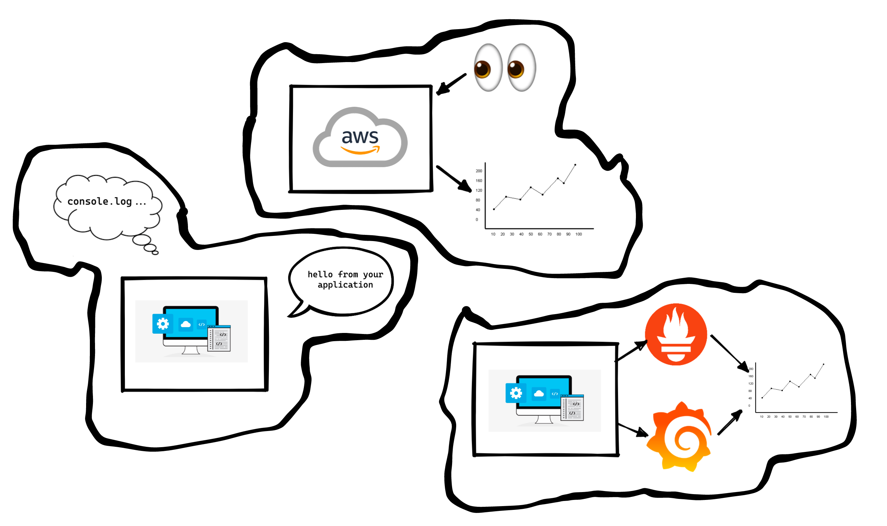
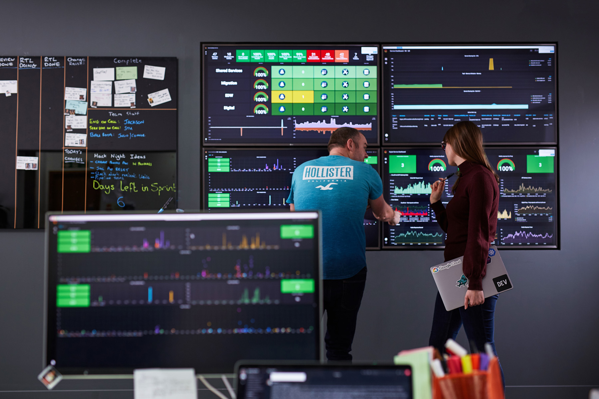
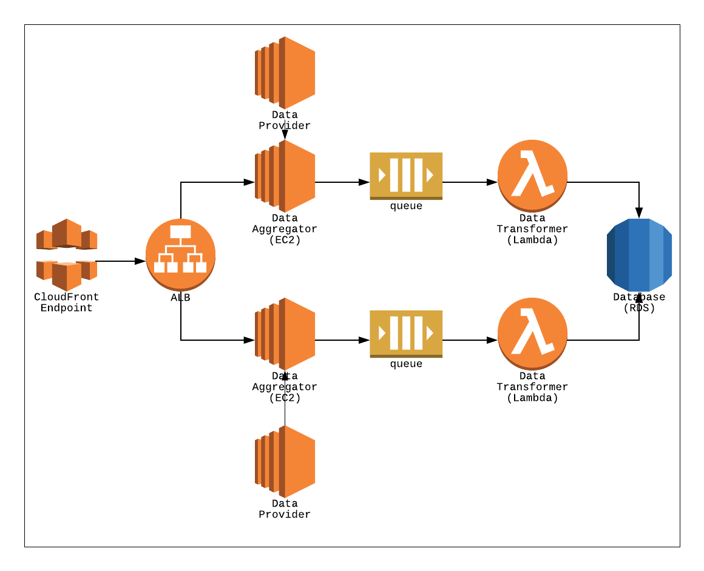
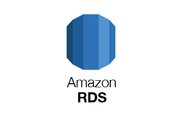
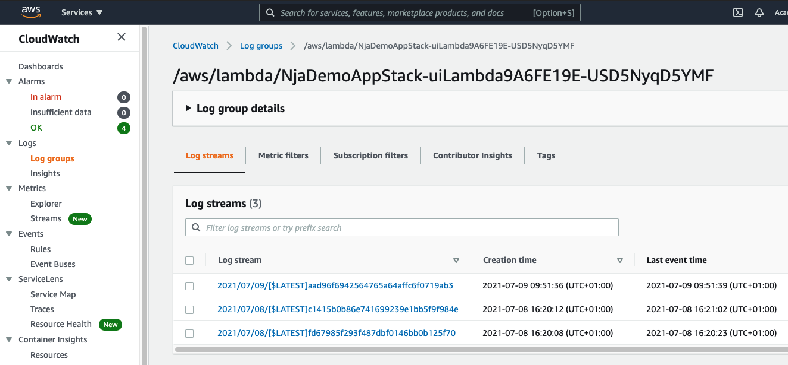
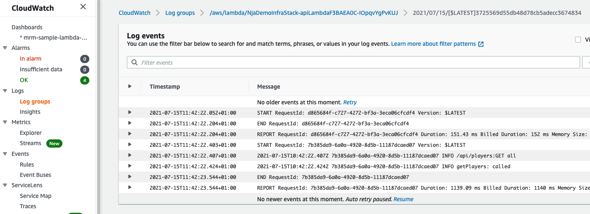
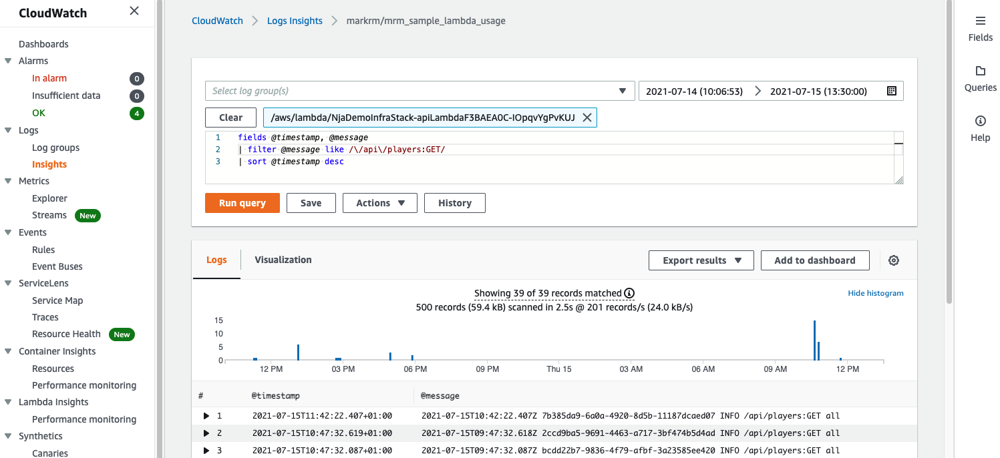
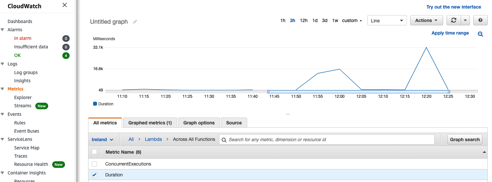
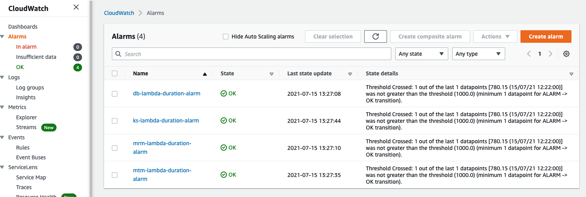
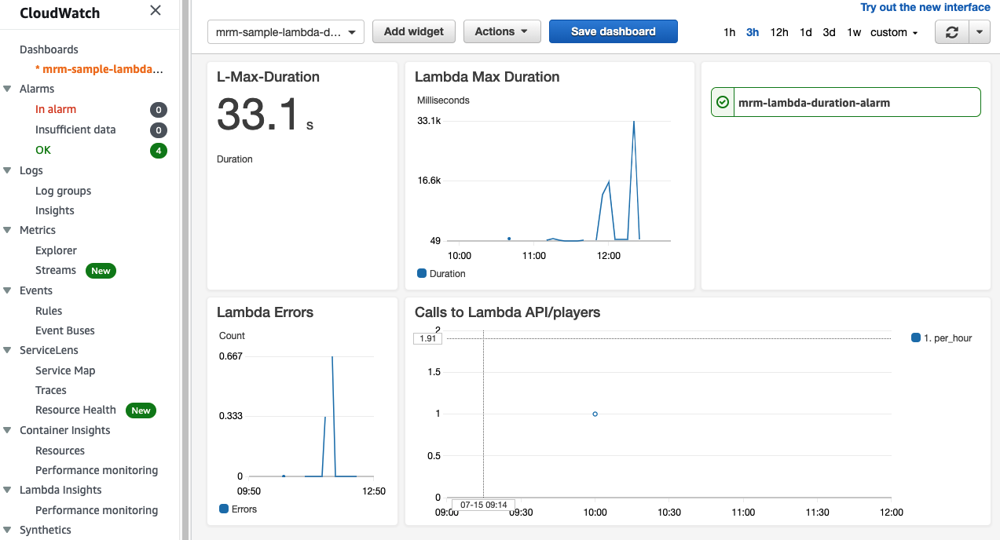

# Logging and Monitoring

<aside class="notes">
  N/A
</aside>

---

## Overview

- Overview of software monitoring
- Why we monitor software
- Monitoring applications
- Monitoring infrastructure

<aside class="notes">
  N/A
</aside>

---

## Objectives

- Understand how we can log and monitor our infrastructure in AWS
- Understand logging and logging libraries
- Understand how we can log and monitor our local applications
- Be familiar with metrics and dashboards with examples

<aside class="notes">
  N/A
</aside>

---

## Objectives

<!-- .element: class="centered" -->

---

<!-- .element: class="centered" -->

<aside class="notes">
  Here's an example from our very own office!

  Show this full screen (open image in new tab) and discuss the traffic lights etc.
</aside>

---

## Why do we monitor software?

<span>- Take action before (or at least as soon as) things go wrong</span><!-- .element: class="fragment" -->

<span>- Understand actual application usage patterns</span><!-- .element: class="fragment" -->

<span>- Make more accurate business decisions</span><!-- .element: class="fragment" -->

<span>- Learn what normal looks like</span><!-- .element: class="fragment" -->

<span>- Assess the impact of our releases: performance degradation, regressions, downtime...</span><!-- .element: class="fragment" -->

<span>- Identify areas in our architecture to improve</span><!-- .element: class="fragment" -->

<span>- Make on-call go as smoothly as possible</span><!-- .element: class="fragment" -->

<aside class="notes">
Be proactive rather than reactive when it comes to managing the health of your application.

As full-stack, DevOps engineers deploying stuff to prod is only the beginning.

The service needs to be supported and managed afterwards.

Identify pinch points.

Also, on the release impact point, it allows us not only to smoke test our app post-release but also pre-release as we can deploy the same monitoring config to our test environments
</aside>

---

## What do we monitor?

Infrastructure

- Lambdas
- Databases
- etc

Applications

- Code Errors
- Important runtime information (variable values or requests)

<aside class="notes">
A quick description of the sort of things we might need to keep an eye on within an application
</aside>

---

What might we monitor on these components?

<!-- .element: class="centered" -->

<aside class="notes">
Components of this diagram that are worthwhile monitoring in some way - EC2 resource usage, RDS resource usage, length of queue, Lambda invocations, lambda max duration, etc.
</aside>

---

## Lambda

<!-- .element: class="centered" -->

<span>Invocations</span><!-- .element: class="fragment" -->
<span>- Errors</span><!-- .element: class="fragment" -->
<span>- Duration</span><!-- .element: class="fragment" -->

<aside class="notes">
  If you can think of any more than smash them in here
</aside>

---

## RDS

<!-- .element: class="centered" -->

<span>CPU Utilisation</span><!-- .element: class="fragment" -->
<span>- Read IOPS (input/output operations per second)</span><!-- .element: class="fragment" -->
<span>- Freeable memory</span><!-- .element: class="fragment" -->

<aside class="notes">
  N/A
</aside>

---

## Emoji Check:

Do we have a better idea of what and why we might want to monitor our stack?

1. 😢 Haven't a clue, please help!<br/>
2. 🙁 I'm starting to get it but need to go over some of it please<br/>
3. 😐 Ok. With a bit of help and practice, yes<br/>
4. 🙂 Yes, with team collaboration could try it<br/>
5. 😀 Yes, enough to start working on it collaboratively<br/>

<aside class="notes">
    The phrasing is such that all answers invite collaborative effort, none require solo knowledge.

    The 1-5 are looking at (a) understanding of content and (b) readiness to practice the thing being covered, so:

    1. 😢 Haven't a clue what's being discussed, so I certainly can't start practising it (play MC Hammer song)
    2. 🙁 I'm starting to get it but need more clarity before I'm ready to begin practising it with others
    3. 😐 I understand enough to begin practising it with others in a really basic way
    4. 🙂 I understand a majority of what's being discussed, and I feel ready to practice this with others and begin to deepen the practice
    5. 😀 I understand all (or at the majority) of what's being discussed, and I feel ready to practice this in depth with others and explore more advanced areas of the content
</aside>

---

## Monitoring Infrastructure

If we are deploying to AWS then in order to monitor and keep an eye on our code we can use their in built cloudwatch logs service.

<aside class="notes">
  N/A
</aside>

---

## AWS CloudWatch

AWS logs, monitoring and alerting managed service

CloudWatch offers:

- Log groups and streams that can aggregate and filter information
- Monitoring dashboards for AWS infrastructure
- Alarms that can trigger when certain conditions are met
- Advanced log search functionality (insights)

<aside class="notes">
  N/A
</aside>

---

## CloudWatch Log Groups

Each "application" in CloudWatch logs into `Group` of `streams`:

<!-- .element: class="centered" -->

<aside class="notes">
  Details on following slides
</aside>

---

## CloudWatch Log Events

Each `stream` of data contains our log `lines` (here, from a lambda invocation):

<!-- .element: class="centered" -->

<aside class="notes">
  Details on following slides
</aside>

---

## CloudWatch Logs

CloudWatch can collate and store all of your logs for as long as you want so you don't have to worry about maintaining them.

Some AWS managed services, like Lambda, will forward all logs automatically to CloudWatch, where you'll be able to search and query them.

<aside class="notes">
  N/A
</aside>

---

## Some Pre-Breakout setup

We want to restrict access to our application to only authorised users.

In your `~/.zshrc` or `~/.bashrc` file, create a new environment variable:

```sh
export MY_IP_ADDRESS='<your-public-IP-here>/32'
```

Replace with your own IP, e.g. `52.51.7.138` - you can find this by typing 'what is my IP' into Google.

The `/32` part means _only this specific IP_, not a range of addresses.

<aside class="notes">
  Feel free to demo this and have them all do it in the main room or break them out to do this.
</aside>

---

## Deploy our application and check out some logs! - Breakout 10m

We have a demo project in `./exercises/monitoring-cdk-lambda`. Let's deploy our application (The CDK is already set up!) and take a look at our logs.

- Run `npm i` in both the top level of the project
- Also run `npm i` in the `/functions` folder
- Run `npx cdk deploy` at the top level of your example project
- Use the output URL and hit the `/names` endpoint a few times
- Find your lambda logs and see if you can locate your log lines
- Share the link to your endpoint with a peer - What happens when they call your endpoint? Why?

<aside class="notes">
  Feel free to demo this and have them all do it in the main room or break them out to do this.

  Note that the output URL is for the root path which has no method attached - navigate to `/names` to hit a valid endpoint.

  Discuss why their URL is not accessible to others (we restricted access by IP address).
</aside>

---

### CloudWatch Logs Insights

These are a log search and analysis tool built into AWS.

<!-- .element: class="centered" -->

<aside class="notes">
  Details on following slides
</aside>

---

### CloudWatch Logs Insights

We can use these to sift through and analyse your logs quickly using a flexible query syntax:

```sql
fields @timestamp, @message
| filter @message like /pokemon/
| sort @timestamp desc
```

<aside class="notes">
  Show and tell on next slide
</aside>

---

### Task - CloudWatch Logs Insights - 10m

> Lets see some of that in our AWS examples

_Lets use Insights to look at the logs we saw before_

- Filter
- Stats by count/bin
- Saving queries by name

<aside class="notes">
  Demo some of this from logs the teams have produced in AWS (i.e. team projects or demo apps).

  Show a simple filter on @message

  Show a simple time series i.e. `stats count(@message) as the_count by bin(1h) as the_time`

  Show saving a query for later
</aside>

---

### CloudWatch Metrics

<!-- .element: class="centered" -->

<aside class="notes">
  Details on following slides
</aside>

---

### CloudWatch Metrics

- Monitor and graph the performance and health of your AWS infrastructure
- Most AWS managed services come with an assortment of predefined CloudWatch metrics
- You can create your own personalised monitoring dashboards with these

<aside class="notes">
  N/A
</aside>

---

### CloudWatch Metrics - Task 5 mins

> Lets see some of that in our AWS accounts

_Lets see some metrics from our Lambdas or ECSs, like Lambda Duration_

<aside class="notes">
  Show-and tell some CloudWatch Metrics - Lambda duration and Lambda Errors is good.

  Start on a Lambda page and show the metrics there, then find them in Cloudwatch.
</aside>

---

### CloudWatch Alarms

<!-- .element: class="centered" -->

<aside class="notes">
  Details on following slides
</aside>

---

### CloudWatch Alarms

Send a notification when a performance/health threshold is exceeded

Alarms notify you when things go wrong so that you can take corrective action as soon as possible

CloudWatch Alarms can be raised in a number of ways:

- CloudWatch Alarms Dashboard
- Email (SNS)
- Lambda

<aside class="notes">
Simple Notification Service - fans out notifications to different subscribers via various channels, e.g. email, SMS, push notifications, lambdas
</aside>

---

### Task - CloudWatch Alarms - 5m

> Lets see some of that in our AWS accounts

_We will all make an alarm_

<aside class="notes">
  Show-and tell some CloudWatch Alarms
</aside>

---

### Emoji Check:

How do you feel about using Cloudwatch metrics and Alarms?

1. 😢 Haven't a clue, please help!<br/>
2. 🙁 I'm starting to get it but need to go over some of it please<br/>
3. 😐 Ok. With a bit of help and practice, yes<br/>
4. 🙂 Yes, with team collaboration could try it<br/>
5. 😀 Yes, enough to start working on it collaboratively<br/>

<aside class="notes">
    The phrasing is such that all answers invite collaborative effort, none require solo knowledge.

    The 1-5 are looking at (a) understanding of content and (b) readiness to practice the thing being covered, so:

    1. 😢 Haven't a clue what's being discussed, so I certainly can't start practising it (play MC Hammer song)
    2. 🙁 I'm starting to get it but need more clarity before I'm ready to begin practising it with others
    3. 😐 I understand enough to begin practising it with others in a really basic way
    4. 🙂 I understand a majority of what's being discussed, and I feel ready to practice this with others and begin to deepen the practice
    5. 😀 I understand all (or at the majority) of what's being discussed, and I feel ready to practice this in depth with others and explore more advanced areas of the content
</aside>

---

### CloudWatch Dashboards

<!-- .element: class="centered" -->

<aside class="notes">
  Details on following slides
</aside>

---

### CloudWatch Dashboards

We can group `widgets` onto a `dashboard` to show ourselves te state of our system. Not as fancy as Grafana (see later) but very effective:

<!-- .element: class="centered" -->

<aside class="notes">
  n/a
</aside>

---

### Task - CloudWatch Dashboard - many minutes

> Lets see some of that in our AWS accounts

_We will all make a basic dashboard_

<aside class="notes">
  Show-and tell some CloudWatch Dashboard magic - make one from the previous alarms and metrics and insight queries
</aside>

---

### Emoji Check:

How do you feel about using Cloudwatch Dashboards?

1. 😢 Haven't a clue, please help!<br/>
2. 🙁 I'm starting to get it but need to go over some of it please<br/>
3. 😐 Ok. With a bit of help and practice, yes<br/>
4. 🙂 Yes, with team collaboration could try it<br/>
5. 😀 Yes, enough to start working on it collaboratively<br/>

<aside class="notes">
    The phrasing is such that all answers invite collaborative effort, none require solo knowledge.

    The 1-5 are looking at (a) understanding of content and (b) readiness to practice the thing being covered, so:

    1. 😢 Haven't a clue what's being discussed, so I certainly can't start practising it (play MC Hammer song)
    2. 🙁 I'm starting to get it but need more clarity before I'm ready to begin practising it with others
    3. 😐 I understand enough to begin practising it with others in a really basic way
    4. 🙂 I understand a majority of what's being discussed, and I feel ready to practice this with others and begin to deepen the practice
    5. 😀 I understand all (or at the majority) of what's being discussed, and I feel ready to practice this in depth with others and explore more advanced areas of the content
</aside>

---

## Before we Monitor, we must first Log

Monitoring software involves continuously measuring the performance of a running system as well as the events taking place in it as they occur. Before we can do that however we need to collect this information:

- Logging
- Metrics

<aside class="notes">
  N/A
</aside>

---

## The almighty Console.log

By now you will all have used a console log at least once in the course, these are a great starting point for logging, can you name some uses for console.log?

<ul>
  <li>The state of variables throughout the application</li><!-- .element: class="fragment" -->
  <li>Knowing where the code has reached</li><!-- .element: class="fragment" -->
  <li>Any errors that are thrown</li><!-- .element: class="fragment" -->
  <li>Any other information we might need</li><!-- .element: class="fragment" -->
</ul>

<aside class="notes">
  N/A
</aside>

---

## Logging Library Pino

Sometimes we want more control over our logging, and we can achieve this by utilising logging libraries such as Pino, some advantages of this is:

- Manageable JSON logs
- Has built in censoring ability for PII (Personal information identifier)
- Can determine the log level severity (Info, Error and more)
- You can add more custom log levels

Open up [https://github.com/pinojs/pino](https://github.com/pinojs/pino)

<aside class="notes">
  There will likely be more than this but its a good start
</aside>

---

Logging statements are added at key areas of your codebase and can serve many different purposes - and their severity helps sort them.

ℹ️ Infos: they document normal state changes in the app. They contain non-actionable information

⚠️ Warnings: non-fatal errors, the kind of events you can leave until the next morning

🚨 Errors: fatal, the kind of events you'd be woken up in the middle of the night to resolve

<aside class="notes">
  N/A
</aside>

---

## Add Pino logging to an existing application - Breakout 10mins

In the `./exercises/monitoring-cdk-lambda` folder is a CDK application that we will be tweaking for the rest of the session. Take some time taking a look and seeing what it does and then do the following:

- Change to the `/functions` folder
- Add the npm library Pino to the application
    - Use the instructions at https://github.com/pinojs/pino#install
- Change the logging of the lambda endpoints from `console.log()`
    - Use the instructions at https://github.com/pinojs/pino#usage
- If you get stuck then contact an instructor

<aside class="notes">
  Direct them to the correct resource online as above.
</aside>

---

## Has it worked?

For the most part you will not see much difference when you run your application, the same logs will have been outputted.

But to be sure, lets try that out on the next slide!

<aside class="notes">
  N/A
</aside>

---

## Where do these logs go? - Breakout 5mins

When we log in an application they are often outputted to a file or the console. Logging libraries separate this code out so you know that they will appear where you want them.

Lets see these now:

- Run the command `make up` in the top level of the example application
- Once the containers are up and running try to hit your endpoint at http://localhost:9091/names
- Can you see your logs?

<aside class="notes">
A quick breakout for them to explore the local setup of this example application, there are a couple endpoints they might have added logging to so you can get them to try and hit those to see them output in the docker logs
</aside>

---

## Overview - recap

- What is software monitoring?
- Why do we monitor software?
- What is monitoring infrastructure?
- Which monitoring applications can we use?

<aside class="notes">
  N/A
</aside>

---

## Objectives - recap

Now you should have...

- A better understanding of Alerts in AWS
- More knowledge of Dashboards in AWS
- A clearer picture of how we can use these for Monitoring

<aside class="notes">
  N/A
</aside>

---

## Further Reading and Credits

- [CloudWatch Logs Insights Query Syntax](https://docs.aws.amazon.com/AmazonCloudWatch/latest/logs/CWL_QuerySyntax.html)
- [CloudWatch Logs Query Syntax](https://docs.aws.amazon.com/AmazonCloudWatch/latest/logs/FilterAndPatternSyntax.html)
- [Prometheus Docs](https://prometheus.io/docs/)
- [Grafana Docs](https://grafana.com/docs/)

<aside class="notes">
  N/A
</aside>

---

### Emoji Check:

On a high level, do you think you understand the main concepts of this session? Say so if not!

1. 😢 Haven't a clue, please help!
2. 🙁 I'm starting to get it but need to go over some of it please
3. 😐 Ok. With a bit of help and practice, yes
4. 🙂 Yes, with team collaboration could try it
5. 😀 Yes, enough to start working on it collaboratively

<aside class="notes">
    The phrasing is such that all answers invite collaborative effort, none require solo knowledge.

    The 1-5 are looking at (a) understanding of content and (b) readiness to practice the thing being covered, so:

    1. 😢 Haven't a clue what's being discussed, so I certainly can't start practising it (play MC Hammer song)
    2. 🙁 I'm starting to get it but need more clarity before I'm ready to begin practising it with others
    3. 😐 I understand enough to begin practising it with others in a really basic way
    4. 🙂 I understand a majority of what's being discussed, and I feel ready to practice this with others and begin to deepen the practice
    5. 😀 I understand all (or at the majority) of what's being discussed, and I feel ready to practice this in depth with others and explore more advanced areas of the content
</aside>
